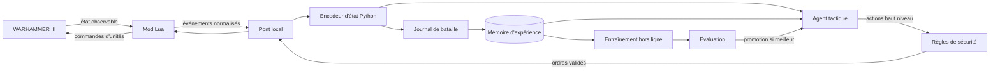
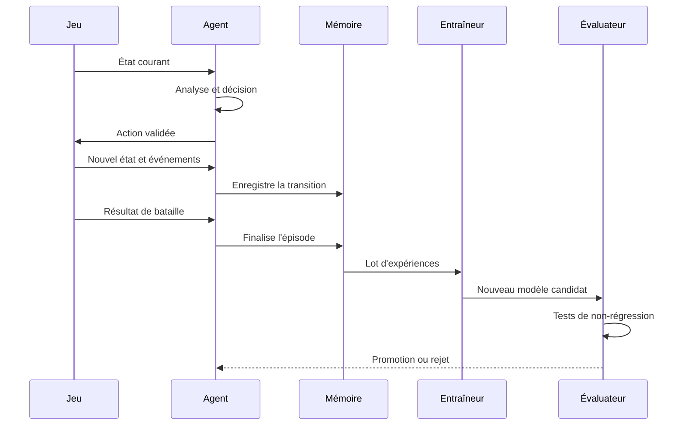

# TotalWarAI

> Agent tactique expérimental, persistant et progressivement apprenant pour les batailles solo de **Total War: WARHAMMER III**.

[](#état-du-projet)
[](#périmètre)
[](#principes-et-limites)
[](#architecture-cible)
[](#architecture-cible)

---

## Sommaire

- [Vision](#vision)
- [Objectif concret](#objectif-concret)
- [État du projet](#état-du-projet)
- [Démarrage rapide](#démarrage-rapide)
- [Développement](#développement)
- [Périmètre](#périmètre)
- [Principes et limites](#principes-et-limites)
- [Pourquoi une approche hybride](#pourquoi-une-approche-hybride)
- [Architecture cible](#architecture-cible)
- [Boucle d’apprentissage](#boucle-dapprentissage)
- [Représentation d’une bataille](#représentation-dune-bataille)
- [Espace d’actions](#espace-dactions)
- [Système de récompense](#système-de-récompense)
- [Mémoire persistante](#mémoire-persistante)
- [Évaluation et prévention des régressions](#évaluation-et-prévention-des-régressions)
- [Feuille de route](#feuille-de-route)
- [MVP](#mvp)
- [Structure prévue du dépôt](#structure-prévue-du-dépôt)
- [Contrats d’interface](#contrats-dinterface)
- [Configuration](#configuration)
- [Journalisation et observabilité](#journalisation-et-observabilité)
- [Stratégie de tests](#stratégie-de-tests)
- [Démarrage du développement avec Codex](#démarrage-du-développement-avec-codex)
- [Critères de réussite](#critères-de-réussite)
- [Risques techniques](#risques-techniques)
- [Contribuer](#contribuer)
- [Licence](#licence)

---

## Vision

**TotalWarAI** a pour but de créer un agent capable de prendre en charge une armée pendant les batailles d’une campagne solo de *Total War: WARHAMMER III*.

L’utilisateur reste le spectateur, le superviseur et, si nécessaire, le décideur de dernier recours. L’agent doit :

1. observer l’état de la bataille ;
2. comprendre les rôles des unités ;
3. construire un plan tactique cohérent ;
4. envoyer des ordres au jeu ;
5. mesurer les conséquences de ses décisions ;
6. mémoriser l’expérience acquise ;
7. améliorer progressivement ses choix d’une bataille à l’autre.

Le projet ne cherche pas à produire immédiatement une « intelligence générale ». Il vise d’abord un **général autonome fiable**, explicable et meilleur qu’une délégation naïve à l’IA interne du jeu.

---

## Objectif concret

La première ambition jouable est la suivante :

> Lancer une bataille de campagne, activer TotalWarAI, laisser l’agent déployer et commander l’armée, puis obtenir à la fin un rapport indiquant ce qu’il a tenté, ce qui a fonctionné, ce qui a échoué et ce qu’il conservera en mémoire.

À terme, l’agent devra notamment savoir :

- former une ligne de front cohérente ;
- protéger les unités à distance et l’artillerie ;
- éviter les charges suicidaires ;
- préserver le seigneur et les héros fragiles ;
- utiliser la cavalerie pour flanquer, poursuivre ou interrompre les tireurs ;
- concentrer les attaques sur des cibles prioritaires ;
- désengager les unités vulnérables ;
- tenir compte de la fatigue, du moral, des munitions et des pertes ;
- adapter son comportement aux compositions d’armée rencontrées ;
- comparer ses décisions actuelles à ses batailles précédentes.

---

## État du projet

**Statut actuel : MVP fonctionnel hors du jeu.**

Le cœur Python est implémenté et testable sans lancer *WARHAMMER III* :

- modèles typés du domaine, sérialisation JSON et validation stricte ;
- protocole de pont versionné et `MockBridge` ;
- agent tactique déterministe : classification, groupes, plan, ciblage ;
- règles de sécurité et arrêt d’urgence ;
- simulateur tactique déterministe et cinq scénarios reproductibles ;
- journal d’événements, rapport post-bataille, mémoire SQLite persistante ;
- adaptation bornée de la doctrine d’après l’historique, avec checkpoints ;
- banc des dix scénarios de référence et détection automatique de régressions ;
- interface en ligne de commande (`totalwar-ai`).

Voir [Démarrage rapide](#démarrage-rapide) pour l’essayer, et
[`docs/architecture.md`](docs/architecture.md) pour ce que le dépôt contient
réellement, par opposition à la cible décrite ici.

**Ce qui n’existe pas encore : tout ce qui touche au jeu lui-même.** Aucun mod
Lua, aucun pont réel, aucun contrôle d’une bataille de *WARHAMMER III*, aucun
modèle appris.

La priorité suivante n’est pas l’apprentissage automatique. C’est de vérifier ce que *WARHAMMER III* permet réellement d’observer et de commander depuis :

- les scripts Lua de bataille ;
- les bibliothèques de modding disponibles ;
- un éventuel pont local entre Lua et Python ;
- à défaut, une couche d’automatisation externe limitée.

Aucune promesse de compatibilité ne doit être faite avant la fin du **spike de faisabilité** décrit dans la feuille de route.

---

## Démarrage rapide

Python 3.11 ou plus récent. Aucune dépendance au jeu, aucun service distant.

```bash
python -m venv .venv && source .venv/bin/activate   # Windows : .venv\Scripts\activate
pip install -e ".[dev]"

totalwar-ai scenarios                                # lister les situations
totalwar-ai simulate --scenario ranged_defense       # jouer une bataille
totalwar-ai simulate --scenario ranged_defense       # relancer : la mémoire est rechargée
totalwar-ai history                                  # consulter les batailles passées
totalwar-ai doctrine                                 # voir ce que l'agent a appris
totalwar-ai report <identifiant>                     # relire un rapport
totalwar-ai bench                                    # rejouer le banc de scénarios
```

Le banc rejoue les dix situations de référence à graines fixes et sans mémoire,
puis compare à une référence enregistrée. Il sort en code 1 en cas de
régression, ce qui en fait un garde-fou utilisable avant de pousser un
changement :

```bash
totalwar-ai bench --save-baseline      # figer le niveau actuel
totalwar-ai bench                      # comparer ; code retour 1 si régression
```

À partir de la troisième bataille d’une même composition, l’agent ajuste sa
doctrine d’après ses résultats passés et l’explique :

```text
  doctrine ajustee par l'historique :
    - taux de victoire faible (0% sur 2 batailles) : laisser l'ennemi venir plus pres avant d'engager
    - deroutes repetees (2.0 par bataille) : resserrer la ligne pour que les unites se soutiennent
```

Sans installation, les deux scripts équivalents fonctionnent depuis le dépôt :

```bash
python scripts/run_simulation.py --scenario balanced_clash --explain
python scripts/run_agent.py                          # boucle agent ↔ pont factice
```

Chaque bataille produit :

- `data/battles/<id>.jsonl` — journal d’événements structuré ;
- `data/reports/<id>.md` — rapport post-bataille lisible ;
- une entrée dans `data/totalwar_ai.sqlite3` — mémoire persistante.

Ces répertoires ne sont pas versionnés.

Options utiles : `--seed` pour rejouer exactement une bataille, `--all` pour
enchaîner tous les scénarios, `--no-memory` pour ne rien enregistrer,
`--no-adapt` pour ignorer la doctrine apprise, `--explain` pour afficher les
décisions commentées, `--data-dir` pour écrire ailleurs que dans `data/`.

À noter : une bataille jouée **avec** mémoire dépend de l’historique autant que
de la graine. Pour une reproduction exacte, utiliser `--no-memory` ou
`--no-adapt`.

---

## Développement

```bash
pip install -e ".[dev]"

ruff check .            # style et erreurs courantes
ruff format .           # formatage
mypy src                # typage strict
pytest                  # suite complète
pytest tests/scenarios  # uniquement les garde-fous de comportement
```

Ces quatre commandes doivent passer avant tout commit. La configuration vit
entièrement dans `pyproject.toml`.

La suite de tests se lit en trois niveaux :

| Répertoire | Ce qui y est vérifié |
| --- | --- |
| `tests/unit/` | géométrie, sérialisation, protocole, classification, ciblage, règles de sécurité, récompenses, mémoire |
| `tests/integration/` | boucle état → décision → résultat via le pont, chaîne bataille → journal → rapport → mémoire → rechargement |
| `tests/scenarios/` | les garde-fous du comportement : archers protégés, artillerie qui ne charge pas, poursuite refusée, tir concentré, réserve conservée, déterminisme |

Toute doctrine ajoutée devrait être comparée à son absence sur le banc de
scénarios (`totalwar-ai bench`) avant d’être conservée : une intuition tactique
plausible peut dégrader l’agent (exemple mesuré dans
[`docs/decisions/0004-reorientation-du-front-mesuree-puis-ecartee.md`](docs/decisions/0004-reorientation-du-front-mesuree-puis-ecartee.md)).

L’adaptation a ses propres garde-fous : `tests/unit/test_adaptation.py` vérifie
que dix cycles d’ajustement successifs restent dans les bornes et qu’aucune
règle de sécurité n’est assouplie ; `tests/integration/test_adaptation_pipeline.py`
vérifie que l’historique change réellement les ordres, et que `--no-adapt`
restaure le comportement de référence.

Les réglages de doctrine, le barème de récompense, la classification des unités
et les paramètres du simulateur sont dans `config/` : les ajuster ne demande pas
de toucher au code.

Documentation technique : [`docs/architecture.md`](docs/architecture.md),
[`docs/protocol.md`](docs/protocol.md),
[`docs/feasibility.md`](docs/feasibility.md) et les décisions dans
[`docs/decisions/`](docs/decisions/).

---

## Périmètre

### Inclus dans la première version

- batailles lancées depuis une campagne solo ;
- contrôle d’une armée appartenant au joueur ;
- batailles terrestres standards ;
- observation et classification des unités ;
- placement initial ;
- ordres tactiques simples ;
- mémoire persistante entre les batailles ;
- rapport post-bataille ;
- reprise manuelle du contrôle à tout moment ;
- fonctionnement local, sans service distant obligatoire.

### Prévu plus tard

- sièges ;
- embuscades ;
- renforts multiples ;
- sorts et capacités activables ;
- doctrines propres à chaque faction ;
- apprentissage par imitation ;
- apprentissage hors ligne à partir de l’historique ;
- éventuel assistant de campagne stratégique ;
- mode réalisateur avec caméra automatique.

### Hors périmètre initial

- multijoueur ;
- parties classées ou compétitives ;
- contournement d’un système anti-triche ;
- modification de la mémoire du jeu ;
- bot universel pilotant toute l’interface de campagne ;
- modèle de langage décidant directement de chaque mouvement ;
- apprentissage entièrement aléatoire dans une vraie campagne.

---

## Principes et limites

### Solo uniquement

Le projet est conçu pour une utilisation personnelle en campagne solo. Il ne doit pas fournir d’avantage dans un environnement multijoueur.

### Pas de triche cachée

L’agent ne doit utiliser que les informations qu’un joueur pourrait raisonnablement connaître :

- unités visibles ;
- positions visibles ;
- état observable ;
- informations disponibles dans l’interface ou l’API autorisée.

Il ne doit pas lire les intentions internes de l’ennemi, révéler des unités cachées ou obtenir des ressources artificielles.

### Contrôle humain prioritaire

Un mécanisme d’arrêt d’urgence doit toujours permettre de :

- suspendre l’agent ;
- rendre instantanément le contrôle au joueur ;
- interrompre une série d’ordres ;
- désactiver l’apprentissage pour une session.

### Explicabilité avant complexité

Chaque décision importante doit pouvoir être résumée :

```text
Action : replier les archers
Cause : cavalerie ennemie à moins de 70 mètres
Objectif : éviter un engagement au corps à corps
Confiance : 0,82
```

---

## Pourquoi une approche hybride

Une IA purement apprenante commencerait par jouer presque au hasard. Dans *Total War*, une bataille dure longtemps et fournit peu d’expériences par heure. Un apprentissage par renforcement naïf demanderait probablement un volume irréaliste de parties avant d’obtenir un comportement acceptable.

TotalWarAI utilisera donc plusieurs couches complémentaires :

1. **Règles de sécurité** — empêchent les comportements manifestement absurdes.
2. **Doctrine tactique** — fournit un niveau de jeu minimal immédiatement utilisable.
3. **Système de scores** — compare plusieurs actions possibles.
4. **Mémoire d’expérience** — conserve les situations et résultats passés.
5. **Modèle apprenant** — ajuste progressivement les priorités et choix.
6. **Évaluateur** — refuse un nouveau modèle s’il régresse sur les scénarios de référence.

L’apprentissage ne remplace pas les règles fondamentales. Il améliore les décisions à l’intérieur d’un cadre sûr.

---

## Architecture cible



### 1. Mod Lua

Responsabilités envisagées :

- détecter le début et la fin d’une bataille ;
- recenser les unités alliées et ennemies accessibles ;
- exposer leur état à intervalles réguliers ;
- recevoir des actions haut niveau ;
- convertir ces actions en ordres de jeu ;
- signaler les refus ou échecs d’exécution ;
- permettre la reprise manuelle du contrôle.

### 2. Pont local

Le pont relie le jeu au processus Python. Le moyen exact dépendra des possibilités réelles de l’environnement Lua.

Options à étudier, dans cet ordre :

1. mécanisme officiellement accessible depuis les scripts ;
2. échange de fichiers locaux append-only ;
3. communication via processus auxiliaire autorisé ;
4. automatisation externe en dernier recours.

Le protocole doit être versionné, tolérant aux erreurs et capable de fonctionner sans bloquer la boucle du jeu.

### 3. Agent Python

Responsabilités :

- transformer les données brutes en représentation tactique ;
- attribuer un rôle aux unités ;
- détecter les menaces et opportunités ;
- choisir un plan ;
- générer des actions haut niveau ;
- estimer la confiance de chaque décision ;
- enregistrer les transitions d’expérience ;
- charger et sauvegarder les modèles.

### 4. Entraîneur hors ligne

L’entraînement ne doit pas ralentir la bataille. Il se déroule :

- entre deux sessions ;
- après un lot de batailles ;
- ou sur commande explicite.

### 5. Évaluateur

Chaque candidat est comparé au modèle stable. Un modèle n’est promu que s’il améliore les performances générales sans dépasser les seuils de régression.

---

## Boucle d’apprentissage



Une expérience élémentaire suit le format conceptuel :

```python
experience = {
    "battle_id": "uuid",
    "timestamp": 0.0,
    "state": {},
    "action": {},
    "reward": 0.0,
    "next_state": {},
    "done": False,
    "metadata": {},
}
```

Une bataille complète correspond à un épisode composé de plusieurs expériences.

---

## Représentation d’une bataille

L’agent ne doit pas dépendre directement de centaines de champs propres au jeu. Les données sont normalisées dans un modèle interne stable.

### Unité

```json
{
  "id": "player_unit_07",
  "side": "ally",
  "role": "ranged_infantry",
  "position": {"x": 125.4, "y": 0.0, "z": 82.1},
  "heading": 1.57,
  "health_ratio": 0.84,
  "entity_ratio": 0.77,
  "morale": 61.0,
  "fatigue": 0.32,
  "ammo_ratio": 0.48,
  "is_engaged": false,
  "is_routing": false,
  "is_hidden": false,
  "current_target_id": null,
  "tags": ["missile", "armour_piercing"]
}
```

### État global

L’état global pourra contenir :

- temps écoulé ;
- phase tactique courante ;
- rapport de puissance estimé ;
- centroïdes des deux armées ;
- largeur de front ;
- unités isolées ;
- menaces sur les tireurs ;
- état du seigneur ;
- zones contrôlées ;
- objectifs de scénario ;
- historique récent des ordres.

### Rôles normalisés

Première taxonomie envisagée :

- `lord`
- `hero_melee`
- `hero_caster`
- `melee_infantry`
- `spear_infantry`
- `ranged_infantry`
- `artillery`
- `light_cavalry`
- `shock_cavalry`
- `chariot`
- `monster`
- `flying_unit`
- `support`
- `unknown`

Cette taxonomie devra rester configurable pour ne pas coder en dur chaque unité du jeu.

---

## Espace d’actions

Le modèle ne doit pas cliquer directement sur des coordonnées d’écran. Il choisit des **actions tactiques haut niveau**.

Exemples :

```text
HOLD_POSITION(group)
MOVE_GROUP(group, destination, formation)
ATTACK_TARGET(group, target)
FOCUS_FIRE(ranged_group, target)
PROTECT(group, protected_group)
FLANK(group, target, side)
RETREAT(group, destination)
DISENGAGE(group)
CHASE_ROUTING(group, target)
FORM_RESERVE(group)
REORIENT_FRONT(group, direction)
```

Les actions sont ensuite traduites par l’adaptateur Lua en commandes réellement disponibles.

### Hiérarchie des décisions

- **Stratégique de bataille** : défendre, avancer, envelopper, temporiser.
- **Tactique** : assigner les groupes et les cibles.
- **Micro limitée** : déplacer ou désengager une unité particulière.

Le moteur doit éviter de recalculer toute la stratégie à chaque frame. Les décisions seront prises à plusieurs fréquences :

- surveillance critique : fréquence élevée ;
- tactique locale : fréquence moyenne ;
- plan général : fréquence basse.

---

## Système de récompense

Le résultat final ne suffit pas. Un agent récompensé uniquement pour la victoire pourrait apprendre à sacrifier inutilement toute son armée.

### Récompenses positives possibles

- victoire ;
- dégâts efficaces ;
- destruction ou déroute d’une unité ennemie ;
- préservation des unités importantes ;
- maintien d’une formation cohérente ;
- attaque de flanc réussie ;
- neutralisation d’une artillerie ;
- protection des tireurs ;
- conservation des munitions quand aucune cible valable n’est disponible.

### Pénalités possibles

- défaite ;
- mort du seigneur ;
- perte d’une unité ;
- unité isolée sans objectif ;
- archers engagés au corps à corps ;
- cavalerie bloquée dans une mêlée prolongée ;
- tirs alliés ;
- ordres contradictoires trop fréquents ;
- déplacements inutiles ;
- poursuite excessive d’unités déjà en fuite.

### Exemple initial, non définitif

```yaml
reward:
  victory: 1000
  defeat: -1000
  enemy_unit_destroyed: 100
  enemy_unit_routed: 30
  allied_unit_destroyed: -120
  lord_killed: -250
  successful_flank: 25
  ranged_unit_caught_in_melee: -35
  isolated_unit_per_second: -0.5
  unnecessary_order_change: -2
```

Ces valeurs seront configurables, versionnées et testées. Elles ne constituent pas encore un équilibrage validé.

---

## Mémoire persistante

L’agent doit conserver son expérience d’une session à l’autre.

### Données conservées

- épisodes complets ;
- transitions utiles ;
- résumé de bataille ;
- caractéristiques des armées ;
- doctrine utilisée ;
- modèle actif ;
- modèles précédents ;
- métriques d’évaluation ;
- version du jeu et du mod ;
- version du protocole ;
- version du système de récompense.

### Format envisagé

- JSON Lines ou MessagePack pour les événements ;
- SQLite pour l’index et les résumés ;
- fichiers de checkpoint pour les modèles ;
- YAML pour la configuration ;
- Parquet facultatif pour l’analyse de gros volumes.

### Reproductibilité

Chaque bataille doit être associée à :

- un identifiant unique ;
- une graine lorsque disponible ;
- la configuration exacte ;
- la version du modèle ;
- les versions du jeu et du mod ;
- les erreurs de télémétrie détectées.

---

## Évaluation et prévention des régressions

Le fait qu’un modèle récent ait gagné sa dernière bataille ne prouve pas qu’il est meilleur.

### Scénarios de référence

*Les dix sont implémentés — `totalwar-ai scenarios` pour la liste, `totalwar-ai bench` pour les rejouer.*

Le banc de tests devra couvrir au minimum :

1. armée équilibrée contre armée équilibrée ;
2. défense avec unités à distance ;
3. attaque contre artillerie ;
4. menace de cavalerie sur les flancs ;
5. infériorité numérique ;
6. supériorité numérique ;
7. armée lente contre armée mobile ;
8. présence de monstres ;
9. protection d’un seigneur fragile ;
10. poursuite de fin de bataille.

### Métriques

- taux de victoire ;
- valeur d’armée restante ;
- pertes évitables ;
- durée de bataille ;
- dégâts infligés par catégorie ;
- dégâts reçus par catégorie ;
- survie du seigneur ;
- temps passé hors formation ;
- taux d’actions refusées ;
- nombre d’ordres par minute ;
- stabilité entre plusieurs exécutions.

### Promotion d’un modèle

Un modèle candidat devient le modèle stable uniquement s’il :

- dépasse le score global minimal ;
- ne régresse pas au-delà d’un seuil sur un scénario critique ;
- ne déclenche aucune règle de sécurité majeure ;
- produit des actions compatibles avec le protocole courant.

---

## Feuille de route

### Phase 0 — Faisabilité technique

- [ ] Identifier la version du jeu ciblée.
- [ ] Recenser les API Lua de bataille réellement accessibles en campagne.
- [ ] Vérifier l’accès aux unités alliées.
- [ ] Vérifier l’accès aux unités ennemies visibles.
- [ ] Lire positions, état, moral, fatigue et munitions si disponibles.
- [ ] Tester un ordre de déplacement sur une unité.
- [ ] Tester un ordre d’attaque.
- [ ] Tester la reprise manuelle du contrôle.
- [ ] Tester un moyen de communication local.
- [ ] Documenter les impossibilités et contournements.

**Livrable :** preuve de concept capable d’observer au moins une unité et de lui envoyer un ordre contrôlé.

### Phase 1 — Simulateur et contrats

- [x] Définir les schémas `BattleState`, `UnitState` et `AgentAction`.
- [x] Créer un simulateur Python minimal indépendant du jeu.
- [x] Créer un faux adaptateur Lua pour les tests.
- [x] Implémenter le protocole versionné.
- [x] Ajouter validation stricte et gestion des erreurs.

**Livrable :** agent testable sans lancer *WARHAMMER III*. — *atteint*

### Phase 2 — Agent déterministe

- [x] Classification des unités par rôle.
- [x] Création de groupes tactiques.
- [x] Placement de base.
- [x] Ligne d’infanterie.
- [x] Protection des tireurs.
- [x] Réserve.
- [x] Sélection de cible simple.
- [x] Règles anti-suicide.
- [x] Arrêt d’urgence.

**Livrable :** première bataille commandée par des règles explicites. — *atteint dans le simulateur ; reste à faire dans le jeu*

### Phase 3 — Télémétrie et rapports

- [x] Journal d’événements.
- [x] Enregistrement des transitions.
- [x] Résumé post-bataille.
- [x] Explication des décisions.
- [x] Visualisation simple de la chronologie.
- [x] Détection des données incomplètes.

**Livrable :** dataset exploitable et diagnostic lisible. — *atteint*

### Phase 4 — Mémoire et adaptation

- [x] Base SQLite.
- [x] Replay buffer.
- [x] Recherche de situations similaires.
- [x] Ajustement de coefficients par résultats historiques.
- [x] Sauvegarde et chargement de checkpoints.

**Livrable :** comportement influencé par les batailles précédentes. — *atteint : voir [`docs/decisions/0003-adaptation-bornee-de-la-doctrine.md`](docs/decisions/0003-adaptation-bornee-de-la-doctrine.md)*

### Phase 5 — Apprentissage supervisé ou par imitation

- [ ] Enregistrer des décisions humaines optionnelles.
- [ ] Construire un dataset d’exemples.
- [ ] Entraîner un premier modèle de décision.
- [ ] Comparer modèle et règles.
- [ ] Conserver le mode déterministe comme secours.

**Livrable :** modèle capable de reproduire certaines décisions tactiques utiles.

### Phase 6 — Apprentissage hors ligne

- [ ] Définir une méthode adaptée au volume de données réel.
- [ ] Entraîner sur les expériences historiques.
- [x] Mettre en place l’évaluateur automatique.
- [x] Refuser les modèles instables.
- [ ] Suivre les versions et métriques.

**Livrable :** amélioration mesurable sur un banc de scénarios.

### Phase 7 — Extension du jeu couvert

- [ ] cavalerie avancée ;
- [ ] monstres ;
- [ ] volants ;
- [ ] artillerie ;
- [ ] sorts ;
- [ ] sièges ;
- [ ] renforts ;
- [ ] doctrines par faction.

### Phase 8 — Campagne stratégique, facultative

Cette phase ne commence qu’après stabilisation du général de bataille.

- [ ] conseiller de début de tour ;
- [ ] recommandations économiques ;
- [ ] gestion de constructions ;
- [ ] objectifs d’armée ;
- [ ] déplacements sur la carte ;
- [ ] diplomatie assistée ;
- [ ] autopilote stratégique optionnel.

---

## MVP

Le MVP ne contient aucun réseau neuronal obligatoire.

Il est considéré comme réussi lorsqu’il peut :

1. recevoir un état de bataille simulé ;
2. classer des unités en groupes simples ;
3. proposer une formation ;
4. sélectionner une cible ;
5. produire des actions validées ;
6. enregistrer l’épisode ;
7. générer un rapport post-bataille ;
8. recharger sa mémoire au lancement suivant.

Le branchement réel au jeu pourra être développé en parallèle, mais l’agent doit rester testable sans le jeu.

---

## Structure prévue du dépôt

```text
Totalwarai/
├── README.md
├── LICENSE
├── pyproject.toml
├── .gitignore
├── .env.example
├── config/
│   ├── default.yaml
│   ├── rewards.yaml
│   └── unit_roles.yaml
├── docs/
│   ├── architecture.md
│   ├── feasibility.md
│   ├── protocol.md
│   ├── learning.md
│   └── decisions/
├── lua_mod/
│   ├── README.md
│   ├── script/
│   │   ├── battle_observer.lua
│   │   ├── order_executor.lua
│   │   ├── bridge.lua
│   │   └── emergency_stop.lua
│   └── tests/
├── src/
│   └── totalwar_ai/
│       ├── __init__.py
│       ├── cli.py
│       ├── domain/
│       │   ├── battle_state.py
│       │   ├── unit_state.py
│       │   └── actions.py
│       ├── bridge/
│       │   ├── protocol.py
│       │   ├── file_bridge.py
│       │   └── mock_bridge.py
│       ├── agent/
│       │   ├── tactical_agent.py
│       │   ├── planner.py
│       │   ├── unit_classifier.py
│       │   ├── safety_rules.py
│       │   └── explainability.py
│       ├── memory/
│       │   ├── repository.py
│       │   ├── replay_buffer.py
│       │   └── models.py
│       ├── learning/
│       │   ├── trainer.py
│       │   ├── evaluator.py
│       │   └── checkpoints.py
│       ├── telemetry/
│       │   ├── events.py
│       │   ├── battle_logger.py
│       │   └── report.py
│       └── simulation/
│           ├── environment.py
│           └── scenarios.py
├── tests/
│   ├── unit/
│   ├── integration/
│   ├── scenarios/
│   └── fixtures/
├── data/
│   ├── .gitkeep
│   ├── battles/
│   ├── models/
│   └── reports/
└── scripts/
    ├── run_agent.py
    ├── run_simulation.py
    ├── train.py
    └── evaluate.py
```

Les données de bataille et les modèles lourds ne doivent pas être versionnés directement dans Git.

> **État réel du dépôt.** Cette arborescence est la cible. Aujourd'hui, `lua_mod/`
> n'existe pas (Phase 0 non commencée), `bridge/file_bridge.py` et le paquet
> `learning/{trainer,evaluator}.py` sont volontairement différés — voir
> [`docs/decisions/0002-pont-reel-differe.md`](docs/decisions/0002-pont-reel-differe.md).
> Le reste est en place, plus `config/simulation.yaml`,
> `agent/grouping.py`, `simulation/runner.py` et `learning/rewards.py`.

---

## Contrats d’interface

### Message d’état

```json
{
  "protocol_version": "0.1.0",
  "message_type": "battle_state",
  "battle_id": "018f...",
  "sequence": 42,
  "game_time": 125.5,
  "payload": {
    "phase": "engagement",
    "units": []
  }
}
```

### Message d’action

```json
{
  "protocol_version": "0.1.0",
  "message_type": "agent_actions",
  "battle_id": "018f...",
  "sequence": 42,
  "actions": [
    {
      "action_id": "018f...",
      "type": "MOVE_GROUP",
      "actor_ids": ["player_unit_01", "player_unit_02"],
      "parameters": {
        "destination": {"x": 100.0, "y": 0.0, "z": 75.0},
        "formation": "line"
      },
      "reason": "maintenir la ligne de front",
      "confidence": 0.91
    }
  ]
}
```

### Accusé d’exécution

```json
{
  "protocol_version": "0.1.0",
  "message_type": "action_result",
  "battle_id": "018f...",
  "action_id": "018f...",
  "status": "accepted",
  "error": null
}
```

Chaque schéma devra être validé côté Python et côté Lua autant que possible.

---

## Configuration

Exemple envisagé :

```yaml
agent:
  mode: deterministic
  decision_interval_seconds: 2.0
  strategic_interval_seconds: 10.0
  confidence_threshold: 0.55
  allow_learning: true
  allow_model_promotion: false

safety:
  emergency_stop_key: F10
  max_orders_per_minute: 90
  protect_lord: true
  prevent_ranged_melee: true
  prevent_artillery_charge: true

memory:
  database_path: data/totalwar_ai.sqlite3
  replay_capacity: 250000
  keep_raw_battles: true

telemetry:
  level: INFO
  write_jsonl: true
  generate_report: true
```

---

## Journalisation et observabilité

Le système doit produire des journaux structurés, pas seulement du texte libre.

Événements importants :

- `battle_started`
- `unit_discovered`
- `state_received`
- `plan_selected`
- `action_proposed`
- `action_blocked_by_safety`
- `action_sent`
- `action_rejected`
- `reward_assigned`
- `battle_finished`
- `episode_saved`
- `training_started`
- `candidate_evaluated`
- `model_promoted`
- `model_rejected`

Chaque erreur doit inclure le contexte minimal permettant de reproduire le problème.

---

## Stratégie de tests

### Tests unitaires

- classification des unités ;
- calcul de distances ;
- détection d’isolement ;
- scoring des cibles ;
- règles de sécurité ;
- calcul des récompenses ;
- sérialisation des messages.

### Tests d’intégration

- pont simulé vers l’agent ;
- séquence état → décision → résultat ;
- sauvegarde puis rechargement d’un épisode ;
- compatibilité de version du protocole ;
- reprise après message incomplet.

### Tests de scénarios

Les scénarios utilisent des états synthétiques reproductibles afin de vérifier que l’agent :

- protège les archers menacés ;
- n’envoie pas l’artillerie charger ;
- refuse une poursuite dangereuse ;
- concentre ses tireurs sur une cible prioritaire ;
- garde une réserve lorsque la doctrine l’exige.

### Qualité Python visée

- Python 3.12 ou version décidée au démarrage ;
- typage strict ;
- `pytest` ;
- `ruff` ;
- `mypy` ou `pyright` ;
- configuration dans `pyproject.toml` ;
- couverture minimale définie après le premier MVP.

---

## Démarrage du développement avec Codex

### Première mission recommandée

Codex doit commencer par une base indépendante du jeu. Ne pas tenter immédiatement de piloter *WARHAMMER III*.

#### Ticket 001 — Initialiser le cœur Python

**Objectif :** créer un projet Python installable et testable représentant l’état d’une bataille et les actions de l’agent.

**Travail attendu :**

1. créer `pyproject.toml` ;
2. créer le package `src/totalwar_ai` ;
3. définir des modèles typés pour :
   - `Vector3` ;
   - `UnitRole` ;
   - `UnitState` ;
   - `BattlePhase` ;
   - `BattleState` ;
   - `ActionType` ;
   - `AgentAction` ;
   - `ActionResult` ;
4. ajouter sérialisation et validation JSON ;
5. créer un `MockBridge` ;
6. créer un `DeterministicTacticalAgent` minimal ;
7. implémenter trois règles :
   - empêcher l’artillerie de charger ;
   - éloigner une unité à distance menacée au corps à corps ;
   - sélectionner l’unité ennemie visible la plus proche comme cible de secours ;
8. écrire les tests unitaires ;
9. ajouter les commandes de lint, typage et tests dans le README de développement.

**Critères d’acceptation :**

- installation locale réussie ;
- tous les tests passent ;
- aucune erreur de typage ;
- les modèles JSON sont versionnés ;
- aucune dépendance au jeu n’est requise ;
- les règles produisent une explication lisible ;
- le code ne contient aucune logique spécifique à une résolution d’écran.

### Deuxième mission recommandée

#### Ticket 002 — Créer le simulateur tactique minimal

- représenter un terrain plat abstrait ;
- déplacer des unités simplifiées ;
- gérer portée, engagement, dégâts et déroute de façon approximative ;
- exécuter les actions du Ticket 001 ;
- générer un épisode et un rapport ;
- fournir trois scénarios reproductibles.

### Troisième mission recommandée

#### Ticket 003 — Étudier l’intégration Lua

- documenter les API accessibles ;
- produire un prototype minimal ;
- ne pas utiliser d’écriture mémoire ;
- confirmer ou invalider chaque donnée nécessaire ;
- consigner les résultats dans `docs/feasibility.md`.

---

## Critères de réussite

### Court terme

- le dépôt possède une architecture claire ;
- l’agent fonctionne dans un simulateur ;
- les actions sont explicables ;
- les expériences sont persistées ;
- les tests empêchent les régressions grossières.

### Moyen terme

- une bataille réelle peut être observée ;
- au moins un type d’ordre peut être envoyé de manière fiable ;
- l’agent contrôle une composition simple ;
- le joueur peut reprendre le contrôle immédiatement ;
- le rapport post-bataille est exploitable.

### Long terme

- l’agent améliore ses métriques sur un banc fixe ;
- les modèles candidats sont évalués automatiquement ;
- les progrès survivent aux redémarrages ;
- plusieurs compositions d’armée sont prises en charge ;
- les mises à jour du jeu n’obligent pas à réécrire le cœur de l’agent.

---

## Risques techniques

### API de bataille insuffisante

Le jeu peut ne pas exposer toutes les informations ou commandes nécessaires pendant une bataille de campagne.

**Réponse :** commencer par un spike, isoler l’adaptateur et ne pas coupler le cœur Python au jeu.

### Communication Lua ↔ Python limitée

Lua peut ne pas être autorisé à ouvrir un socket ou lancer un processus.

**Réponse :** tester un protocole par fichiers et conserver un `MockBridge` pour le développement.

### Apprentissage trop lent

Quelques batailles réelles ne suffiront pas à entraîner un agent complexe.

**Réponse :** règles solides, imitation, simulateur, apprentissage hors ligne et scénarios synthétiques.

### Récompense mal conçue

L’agent peut optimiser un comportement indésirable.

**Réponse :** métriques multiples, règles de sécurité, rapports explicables et promotion contrôlée.

### Mises à jour du jeu

Les API, scripts ou identifiants peuvent changer.

**Réponse :** adaptateur versionné, tests de compatibilité et séparation stricte des couches.

### Complexité des factions

Le nombre d’unités, sorts et mécaniques est immense.

**Réponse :** commencer avec une composition simple, des rôles génériques et une matrice de compatibilité.

### Données volumineuses

Les journaux peuvent rapidement devenir lourds.

**Réponse :** rotation, compression, résumés, politique de rétention et exclusion Git.

---

## Contribuer

Le projet est encore en phase d’exploration. Toute contribution doit :

- rester compatible avec le mode solo ;
- éviter les dépendances opaques ;
- inclure des tests ;
- documenter les hypothèses ;
- séparer le code générique du code lié au jeu ;
- ne pas introduire de contournement anti-triche ;
- conserver un mode déterministe de secours.

Format de branche conseillé :

```text
feature/nom-court
fix/nom-court
docs/nom-court
experiment/nom-court
```

Format de commit conseillé :

```text
feat: add battle state schema
fix: reject invalid artillery charge
docs: document Lua feasibility findings
test: cover threatened ranged unit retreat
```

---

## Licence

Aucune licence n’est encore définie.

Avant d’accepter des contributions externes ou de distribuer le projet, ajouter un fichier `LICENSE` et vérifier la compatibilité avec :

- les conditions d’utilisation de *Total War: WARHAMMER III* ;
- les règles de Creative Assembly concernant les mods ;
- les licences des bibliothèques utilisées ;
- les éventuels extraits ou références issus d’autres projets.

---

## Avertissement

TotalWarAI est un projet communautaire expérimental, non affilié à Creative Assembly, SEGA ou Games Workshop.

*Total War*, *Total War: WARHAMMER* et les marques associées appartiennent à leurs propriétaires respectifs.
