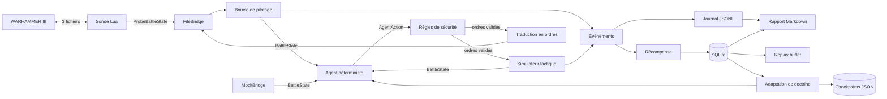

# Architecture

Ce document décrit **ce qui existe réellement dans le dépôt**, par opposition à
la cible décrite dans le `README.md`. Il doit être mis à jour à chaque phase
franchie.

## Vue d'ensemble

Les deux sources d'états sont branchées sur le même agent, et c'était le but :
le cœur Python reste testable sans *WARHAMMER III*, et le branchement au jeu n'a
rien changé aux couches de droite. La seule pièce que le jeu a imposée est
`bridge/orders.py`, qui traduit les actions du domaine dans le vocabulaire
appauvri que le moteur accepte.

## Couches

| Paquet | Rôle | Dépend de |
| --- | --- | --- |
| `domain` | Contrats de données immuables : `Vector3`, `UnitState`, `BattleState`, `AgentAction`, `ActionResult`. Aucune logique de jeu. | — |
| `bridge` | Protocole versionné et adaptateurs : `MockBridge`, plus toute l'intégration au jeu — voir le détail ci-dessous. | `domain`, `agent` |
| `agent` | Classification, groupes, planification, sécurité, explicabilité. | `domain`, `config` |
| `simulation` | Simulateur abstrait, scénarios, boucle de bataille. | tout le reste |
| `telemetry` | Événements structurés, journal JSONL, rapport Markdown. | `domain`, `agent` |
| `memory` | Persistance SQLite, transitions, tampon de rejeu. | `domain`, `telemetry` |
| `learning` | Barème de récompense, adaptation de la doctrine, checkpoints, banc d'évaluation, **et l'observation de l'IA du moteur** : santé du corpus (`corpus.py`) et inférence des décisions (`observation.py`). L'entraînement de modèles viendra en Phase 6. | `domain`, `telemetry`, `memory` |

Règle de dépendance : `domain` ne dépend de rien, et rien dans `domain`,
`bridge` ou `agent` ne connaît le simulateur. L'adaptateur vers le jeu réel s'est
effectivement inséré sans toucher à l'agent — c'est vérifié, pas espéré.

`bridge` est le paquet qui a le plus grossi depuis l'intégration au jeu. Chaque
module y répond à une question distincte :

| Module | Question à laquelle il répond |
| --- | --- |
| `protocol.py` | quel vocabulaire l'agent parle-t-il ? |
| `mock_bridge.py` | comment tester l'agent sans jeu ni simulateur ? |
| `paths.py` | où est le répertoire d'échange, et quelle révision du Lua attend-on ? |
| `command_models.py` | que peut-on réellement dire au jeu, et lui entendre dire ? |
| `file_bridge.py` | comment écrire et lire les trois fichiers sans rien perdre ? |
| `roster.py` | 480 munitions, c'est beaucoup ou peu ? (mémoire des maxima observés) |
| `orders.py` | comment traduire `FLANK` en coordonnées ? |
| `supervision.py` | l'IA du jeu vient-elle de faire une bêtise ? |
| `live.py` | qui appelle tout cela, et dans quel ordre ? |
| `recording.py` | que garde-t-on d'une vraie bataille ? |

`bridge` dépend de `agent` — `live.py` instancie l'agent et `supervision.py`
transpose ses règles de sécurité à l'observation. C'est le sens attendu :
l'agent, lui, ignore toujours qu'un jeu existe.

Deux points de vigilance, appris en ajoutant l'adaptation :

- **`agent` connaît `learning`, jamais l'inverse.** `learning/adaptation.py`
  produit des chiffres et des raisons sans rien savoir de la façon dont l'agent
  est construit ; c'est `agent/doctrine.py` qui les traduit en `PlannerSettings`
  et `SafetySettings`.
- **Les `__init__.py` ne ré-exportent pas au travers des couches.**
  `telemetry/__init__.py` ne ré-exporte volontairement pas `report`, qui dépend
  de `learning`, lequel dépend de `telemetry.events` : l'import du paquet
  bouclerait.
- **`telemetry` ne connaît `agent` qu'en annotation.** `battle_logger` type ses
  paramètres avec `Decision` sous `TYPE_CHECKING` : un import réel refermerait
  la boucle `agent → learning → telemetry → agent`.
- **`learning.evaluation` importe `run_battle` dans le corps de la fonction**,
  pas au niveau du module : `simulation` dépend de `learning`, l'inverse ne doit
  exister qu'au moment de l'appel.

## Décisions structurantes

### L'agent ne calcule jamais de positions individuelles

L'agent émet `MOVE_GROUP(groupe, destination, formation)`. C'est l'adaptateur
— simulateur aujourd'hui, mod Lua demain — qui répartit les unités en ligne
autour du point demandé (`_slots` dans `simulation/environment.py`). L'agent
reste ainsi indépendant de la façon dont le jeu accepte les ordres.

### La sécurité est indépendante du planificateur

`agent/safety_rules.py` ne partage aucun état avec `agent/planner.py`. Le
planificateur a le droit de se tromper ; la sécurité est le filet. Cette
séparation permettra de remplacer le planificateur par un modèle appris sans
toucher aux garde-fous.

### Trois fréquences de décision

`DeterministicTacticalAgent.decide` applique la hiérarchie du `README.md` :

1. **plan général** — recalculé toutes les `strategic_interval_seconds`, ou dès
   qu'un groupe perd une unité ;
2. **tactique locale** — toutes les `decision_interval_seconds` ;
3. **surveillance critique** — à chaque état, si un tireur est menacé ou si le
   commandement est en péril.

### Ordre du pipeline de décision

`plan → propositions → sécurité → anti-répétition → limite de débit`

Cet ordre n'est pas arbitraire : la limite de 90 ordres par minute doit financer
des ordres *nouveaux*. Placée avant la déduplication, elle était intégralement
consommée par des ordres redondants et l'agent devenait muet en pleine bataille.

### L'ancre du plan est la ligne de front

Le plan s'ancre sur le centre de gravité de la **ligne de front**, pas de
l'armée entière. Ancré sur l'armée, replier les tireurs déplace le centre vers
l'arrière, ce qui replie encore les tireurs : l'armée recule indéfiniment sans
jamais combattre. Ce défaut a été observé puis corrigé pendant le développement
du simulateur.

**Le problème n'est pas clos pour autant.** Une dérive du même ordre subsiste en
posture défensive : deux corrections ont été tentées, mesurées sur le banc, et
révoquées parce qu'elles dégradaient les résultats — l'une faisait passer
`balanced_clash` de 100 % à 0 %. Le raisonnement et les chiffres sont dans
[`decisions/0005`](decisions/0005-derive-de-l-ancre-defensive.md).

### La sonde d'intégration parle un protocole séparé

`bridge/command_models.py` définit un protocole **plus pauvre** que celui de
`bridge/protocol.py`. Cette pauvreté est le résultat du recensement mené en
bataille : le bac à sable Lua n'a pas rendu de moral, de fatigue ni de largeur
d'unité.

> **Cette page a longtemps dit « et aucune version future de notre code n'y
> changera quoi que ce soit ». C'était faux, et il faut le dire ici.**
>
> Le recensement avait essayé `unary_morale` et `fatigue`. WARHAMMER III
> documente `fatigue_state()`, `is_wavering()`, `is_crumbling()`,
> `current_target()`, `ordered_width()` — **des noms différents, jamais
> essayés**. Une absence constatée sous un mauvais nom n'est pas une absence.
>
> Le terrain, lui, est déjà tombé : `v_to_ground` fonctionne et
> `bm:get_terrain_height` est présent, voir
> [`feasibility.md`](feasibility.md). L'altitude n'est plus « la seule donnée de
> terrain » par nécessité, mais par recensement inachevé.
>
> Ce que le jeu donne est donc une **capacité négociée par la révision du
> protocole**, jamais une hypothèse permanente.

La sonde a donc cessé d'être une sonde. Elle transporte aujourd'hui la bataille
entière, des manœuvres complètes, et la délégation à l'IA du jeu — le détail est
dans [`protocol.md`](protocol.md#protocole-de-la-sonde--échange-par-fichiers).
Le nom lui reste par honnêteté : elle ne parle pas la langue du domaine.

`FileBridge` n'implémente pas l'interface `Bridge` pour cette raison.
`ProbeUnitObservation.to_unit_state()` est le raccord vers le domaine complet ;
il marque explicitement dans les métadonnées ce que le jeu **ne** fournit pas
(`morale_available`, `fatigue_available`), parce que les valeurs par défaut de
`UnitState` — moral à 50, fatigue à 0 — ressemblent à des mesures sans en être.

Les deux moitiés sont maintenues cohérentes par `tests/integration/test_lua_protocol.py`,
qui lit le script Lua pour vérifier que noms de fichiers, version de protocole,
révision du script et motifs d'analyse concordent avec le code Python. Un second
harnais, `test_lua_probe_execution.py`, exécute le vrai script dans un Lua
embarqué (`lupa`) contre un faux jeu : il a attrapé plusieurs défauts avant
qu'ils ne coûtent un essai en bataille.

### Cinq façons de piloter, une seule boucle

`totalwar-ai probe` expose cinq modes, du plus autonome au plus supervisé :

| Mode | Qui décide | À quoi il sert |
| --- | --- | --- |
| `--play` | notre agent seul | mesurer ce que l'agent sait faire |
| `--observe` | l'IA du jeu seule | établir la référence à battre |
| `--supervise` | l'IA du jeu, nos règles corrigent | le mode de travail visé |
| `--delegate` | l'IA du jeu seule, sans boucle | confier l'armée et rendre la main |
| `--move` | l'opérateur | diagnostic du pont |

`--play`, `--observe` et `--supervise` partagent `bridge/live.py` : même lecture
d'état, même mémoire des effectifs, même traduction en ordres. Ce qui change est
uniquement qui produit les décisions.

**`--observe` est `--supervise` avec un jeu de règles vide.** Ce n'est pas une
économie de code mais une condition de validité : deux chemins distincts ne
produiraient pas deux batailles comparables, et c'est précisément leur
comparaison qui doit dire si nos règles améliorent ou dégradent l'IA du moteur.

### Déléguer à l'IA du jeu, puis la superviser

La lecture ciblée d'AI General 3 a livré un résultat qui a réorienté le projet :
**ce mod ne calcule pas de tactique**. Il confie ses unités à
`script_ai_planner`, l'IA de bataille de Creative Assembly, et consacre
l'essentiel de son code à contourner les angles morts de celle-ci — poursuite
des fuyards, tir à volonté, exclusion du seigneur.

Ce planificateur connaît le terrain, le pathfinding, les statistiques d'unités
et les formations : exactement ce que le recensement a montré inaccessible à un
script Lua. Lui confier l'armée est donc le chemin le plus court vers un mod qui
joue correctement.

`bridge/supervision.py` en tire la conséquence : **l'IA du jeu mène la bataille,
nos règles reprennent la seule unité dont elle fait mauvais usage**, avec un
motif lisible, et la lui rendent dès que la situation est rétablie. Trois règles
seulement (seigneur mourant, artillerie au contact, tireur au contact) — une
supervision qui reprend tout ne supervise plus, elle remplace.

C'est la différence avec `agent/safety_rules.py`, qui juge une action *proposée*
avant qu'elle ne parte. Ici il n'y a aucune action à juger : on ne voit que
l'état, et c'est de lui qu'il faut conclure.

Notre agent n'est pas abandonné pour autant. Il explique ses décisions et il
apprend ; l'IA du jeu ne fait ni l'un ni l'autre. La délégation lui donne une
référence chiffrée à battre, ce qui manquait jusque-là.

### Le banc est la référence, pas l'intuition

`totalwar-ai bench` rejoue les dix scénarios de référence du `README.md` à
graines fixes et **sans mémoire** — aucune doctrine apprise n'est appliquée, de
sorte qu'un écart soit imputable au changement de code et à rien d'autre.

La comparaison à la référence enregistrée se fait **scénario par scénario** :
une amélioration en moyenne ne rachète pas l'effondrement d'une situation, et la
survie du seigneur ne tolère aucune baisse. La commande sort en code 1 en cas de
régression, ce qui la rend utilisable telle quelle comme garde-fou.

### Une doctrine ajoutée doit être mesurée avant d'être gardée

`REORIENT_FRONT` a été implémenté puis retiré : la mesure sur le banc de
scénarios montrait une dégradation reproductible (`outnumbered` passait du match
nul à la défaite) pour un gain nul ailleurs. Le détail chiffré est dans
[`decisions/0004-reorientation-du-front-mesuree-puis-ecartee.md`](decisions/0004-reorientation-du-front-mesuree-puis-ecartee.md).

L'action reste dans le protocole et exécutable par l'adaptateur ; c'est la
doctrine actuelle qui ne l'emploie pas.

### L'adaptation est bornée et explicable

L'agent ajuste cinq réglages d'après son historique, chacun dans des bornes
fixes et accompagné d'une raison en clair reprise dans le rapport. Aucun
garde-fou de sécurité n'est ajustable, et le seul réglage de sécurité touché
— le rayon de menace des tireurs — ne peut bouger qu'à la hausse. Voir
[`decisions/0003-adaptation-bornee-de-la-doctrine.md`](decisions/0003-adaptation-bornee-de-la-doctrine.md).

Conséquence à connaître : une bataille jouée **avec** mémoire n'est plus
reproductible à partir de la seule graine. Le rapport enregistre le profil
appliqué, et `--no-adapt` restaure le comportement de référence.

### L'arrêt d'urgence survit à tout

`SafetyEngine.reset()` remet à zéro le compteur d'ordres mais **ne lève pas**
l'arrêt d'urgence. Reprendre la main est une décision du joueur ; elle ne doit
pas disparaître parce qu'une nouvelle bataille commence.

### Apprendre en regardant jouer l'IA du moteur

Notre agent voit aujourd'hui moins que l'IA du moteur : ni moral ni fatigue, et
du terrain seulement l'altitude — mais c'est l'état d'un recensement **inachevé**
et non une limite prouvée (voir l'encadré plus haut). Écrire des règles à la main
contre un adversaire qui en voit davantage a donc un plafond. La voie retenue est
de **l'observer et d'apprendre ses décisions**.

Trois pièces sont en place, aucune n'ayant encore vu une vraie bataille :

- **l'enregistrement par unité** (`bridge/recording.py`) — position, altitude,
  contact, effectif, munitions, à chaque état publié. Un méga-octet par
  bataille, l'inventaire des unités écrit à part pour ne pas répéter ce qui ne
  change jamais ;
- **la décision fantôme** (`bridge/live.py`) — l'agent décide dans le vide
  pendant l'observation, sans rien envoyer au jeu. Chaque tour devient un couple
  étiqueté « elle a fait ceci, nous aurions fait cela » ;
- **l'inférence des décisions** (`learning/observation.py`) — le jeu ne dit pas
  quel ordre porte une unité ; on le conclut de deux états successifs, et l'on
  compte les cas où l'on n'y arrive pas ;
- **la relecture** (`learning/replay.py`) — un enregistrement redevient la suite
  d'états que la boucle avait sous les yeux, ratios et rôles compris ;
- **l'apprentissage du ciblage** (`learning/targeting.py`) — qui l'IA attaque,
  et avec quoi, normalisé par **ce qui lui était offert** : sans ce
  dénominateur on apprendrait la composition des armées rencontrées, pas une
  préférence ;
- **l'apprentissage de la formation** (`learning/geometry.py`) — où chaque rôle
  se tient dans sa propre armée : profondeur le long de l'axe vers l'ennemi,
  écart au centre, espacement. Tout est relatif à l'armée, donc transportable
  d'une carte à l'autre.

**Les deux s'étalonnent sans jouer.** La doublure a une politique connue
exactement : si l'instrument ne la retrouve pas, il ne dira rien de bon sur
l'IA du jeu. `totalwar-ai learn --calibrate` reproduit la mesure d'une seule
ligne — c'est ainsi qu'a été trouvé, avant tout essai, que la mêlée n'est pas un
choix de cible et faussait la table entière.

**Deux constats se recoupent, et ils tiennent tout le reste.** La mêlée n'est
pas un choix de cible — une unité au contact subit celui qui l'a rattrapée — et
la mêlée n'est pas une formation — les lignes s'y interpénètrent. *Une bataille
se lit dans les instants qui précèdent le choc.*

La formation, elle, ne s'étalonne pas contre la doublure : celle-ci n'en a
aucune. Seul l'instrument est vérifié, contre des états construits dont la
géométrie est connue au mètre près.

Le raisonnement complet est dans
[`decisions/0007`](decisions/0007-observer-pour-apprendre.md),
[`decisions/0008`](decisions/0008-apprendre-le-ciblage.md) et
[`decisions/0009`](decisions/0009-apprendre-la-formation.md).

### Le rapport de forces local

`learning/concentration.py` mesure, pour chaque unité alliée en mêlée, les
ennemis contre les alliés à moins de quarante mètres. C'est la mesure qui a
requalifié les défaites : non pas un effondrement de moral, mais une **défaite
en détail** — le rapport local montait à 2 et 3 contre 1 pendant que le rapport
global restait à 1,2. `Planner.local_balance` est la correction correspondante,
côté choix de cible ([`decisions/0010`](decisions/0010-concentrer-plutot-que-decrocher.md)).

### Ce que les dégâts achètent

`learning/attrition.py` compte ce que nos dégâts ont fait tomber, et non ce
qu'ils ont entamé. En jeu, l'agent avait de quoi abattre dix régiments et n'en a
détruit aucun : la parité locale évite les mauvais combats, elle n'en gagne
aucun. `finishing_value` et `Planner.focus_bonus` corrigent le choix de cible —
achever ce qui est entamé, renforcer ce qu'on est en train de faire tomber
([`decisions/0012`](decisions/0012-achever-plutot-qu-egratigner.md)).

### L'altitude, seule donnée de terrain

`learning/elevation.py` mesure l'écart de hauteur entre les deux lignes, volantes
exclues et sur la **médiane** — un seigneur volant échappe au filtre et une
moyenne y perdrait treize mètres. Le verdict porte sur la phase d'approche : une
fois au contact, la hauteur est subie, et les fuyards qui refluent la font
remonter sans que personne l'ait voulu.

Côté décision, `Planner.slope_advantage` et le durcissement de seuil de
`SuicidalChargeRule` en tirent parti. Le banc ne peut rien en dire — son monde est
plat, ce qui est vérifié et non suppose
([`decisions/0014`](decisions/0014-tenir-la-hauteur.md)).

### Le banc doit d'abord être reproductible

La mêlée du simulateur appliquait ses dégâts dans l'ordre d'itération d'un
ensemble, donc dans un ordre décidé par `PYTHONHASHSEED`. Le banc rendait un
chiffre différent à chaque processus, et des règles ont été jugées sur des écarts
de cette taille. Corrigé, et gardé par un test qui relance l'interpréteur avec
deux graines de hachage
([`decisions/0011`](decisions/0011-le-banc-dependait-de-la-graine-de-hachage.md)).

## Ce qui est vérifié en jeu, et ce qui ne l'est pas

Onze essais en bataille ont eu lieu. La distinction ci-dessous est la seule qui
compte, et elle doit être tenue à jour à chaque essai — le détail chiffré est
dans [`feasibility.md`](feasibility.md).

**Vérifié dans *WARHAMMER III*** : l'écriture et la lecture de fichiers depuis
le Lua de bataille, l'observation de l'armée entière et de l'adversaire, la
classification des unités, les **ordres de déplacement** (20,3 m mesurés par le
jeu), l'agent pilotant une bataille de bout en bout, **l'arrêt d'urgence par
fichier sentinelle** et **la reprise d'unités confiées à l'IA du jeu** (essai
n° 9).

**Écrit et testé contre le faux jeu, jamais exécuté dans le vrai** — et donc à
ne pas présenter comme fonctionnel : les ordres d'attaque et d'immobilisation,
la restitution automatique du contrôle au bout de cinq secondes, l'arrêt
d'urgence par commande, et surtout **que `script_ai_planner` joue effectivement
la bataille** — l'essai n° 9 l'a instancié, sur six unités sur dix-huit, et la
supervision qui l'accompagnait tournait à vide.

La frontière est celle du **journal d'essais**, pas celle de la couverture de
tests : `uc:attack_unit` est acquitté par le Lua et couvert par le harnais
`lupa`, mais aucun essai n'a mesuré son effet en bataille. Un ordre acquitté
n'est pas un ordre exécuté — le moteur acquitte aussi ceux qu'il ignore avant
la phase `Deployed`.

## Ce qui n'existe pas

- **la dérive de l'ancre défensive** reste ouverte : diagnostiquée, reproduite
  dans le scénario `skirmish_standoff`, deux corrections mesurées nuisibles et
  révoquées. Voir [`decisions/0005`](decisions/0005-derive-de-l-ancre-defensive.md) ;
- **le ciblage par affinité** — envoyer chaque unité sur l'adversaire contre
  lequel elle est efficace — et les contournements longs de carte ;
- **une interface utilisateur** : tout passe aujourd'hui par le CLI ;
- apprentissage par imitation, entraîneur hors ligne et évaluateur de modèles
  (Phases 5 et 6) ;
- sièges, embuscades, sorts, doctrines par faction (Phase 7).

Les modules correspondants ne sont volontairement pas créés vides : un fichier
absent est plus honnête qu'un fichier qui ne fait rien.
