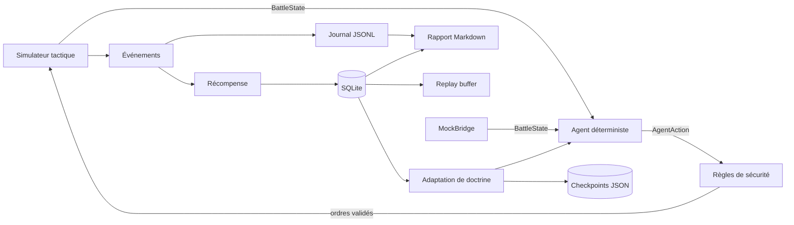

# Architecture

Ce document décrit **ce qui existe réellement dans le dépôt**, par opposition à
la cible décrite dans le `README.md`. Il doit être mis à jour à chaque phase
franchie.

## Vue d'ensemble

La partie gauche du schéma du `README.md` — jeu, mod Lua, pont réel — n'est pas
encore implémentée : le simulateur et le `MockBridge` en tiennent lieu. C'est
délibéré : le cœur Python doit rester testable sans *WARHAMMER III*, et le
branchement au jeu ne doit rien changer aux couches de droite.

## Couches

| Paquet | Rôle | Dépend de |
| --- | --- | --- |
| `domain` | Contrats de données immuables : `Vector3`, `UnitState`, `BattleState`, `AgentAction`, `ActionResult`. Aucune logique de jeu. | — |
| `bridge` | Protocole versionné et adaptateurs. Aujourd'hui : `MockBridge`. | `domain` |
| `agent` | Classification, groupes, planification, sécurité, explicabilité. | `domain`, `config` |
| `simulation` | Simulateur abstrait, scénarios, boucle de bataille. | tout le reste |
| `telemetry` | Événements structurés, journal JSONL, rapport Markdown. | `domain`, `agent` |
| `memory` | Persistance SQLite, transitions, tampon de rejeu. | `domain`, `telemetry` |
| `learning` | Barème de récompense, adaptation de la doctrine et checkpoints. L'entraînement de modèles viendra en Phase 6. | `domain`, `telemetry`, `memory` |

Règle de dépendance : `domain` ne dépend de rien, et rien dans `domain`,
`bridge` ou `agent` ne connaît le simulateur. Un adaptateur vers le jeu réel
s'insère donc sans toucher à l'agent.

Deux points de vigilance, appris en ajoutant l'adaptation :

- **`agent` connaît `learning`, jamais l'inverse.** `learning/adaptation.py`
  produit des chiffres et des raisons sans rien savoir de la façon dont l'agent
  est construit ; c'est `agent/doctrine.py` qui les traduit en `PlannerSettings`
  et `SafetySettings`.
- **Les `__init__.py` ne ré-exportent pas au travers des couches.**
  `telemetry/__init__.py` ne ré-exporte volontairement pas `report`, qui dépend
  de `learning`, lequel dépend de `telemetry.events` : l'import du paquet
  bouclerait.

## Décisions structurantes

### L'agent ne calcule jamais de positions individuelles

L'agent émet `MOVE_GROUP(groupe, destination, formation)`. C'est l'adaptateur
— simulateur aujourd'hui, mod Lua demain — qui répartit les unités en ligne
autour du point demandé (`_slots` dans `simulation/environment.py`). L'agent
reste ainsi indépendant de la façon dont le jeu accepte les ordres.

### La sécurité est indépendante du planificateur

`agent/safety_rules.py` ne partage aucun état avec `agent/planner.py`. Le
planificateur a le droit de se tromper ; la sécurité est le filet. Cette
séparation permettra de remplacer le planificateur par un modèle appris sans
toucher aux garde-fous.

### Trois fréquences de décision

`DeterministicTacticalAgent.decide` applique la hiérarchie du `README.md` :

1. **plan général** — recalculé toutes les `strategic_interval_seconds`, ou dès
   qu'un groupe perd une unité ;
2. **tactique locale** — toutes les `decision_interval_seconds` ;
3. **surveillance critique** — à chaque état, si un tireur est menacé ou si le
   commandement est en péril.

### Ordre du pipeline de décision

`plan → propositions → sécurité → anti-répétition → limite de débit`

Cet ordre n'est pas arbitraire : la limite de 90 ordres par minute doit financer
des ordres *nouveaux*. Placée avant la déduplication, elle était intégralement
consommée par des ordres redondants et l'agent devenait muet en pleine bataille.

### L'ancre du plan est la ligne de front

Le plan s'ancre sur le centre de gravité de la **ligne de front**, pas de
l'armée entière. Ancré sur l'armée, replier les tireurs déplace le centre vers
l'arrière, ce qui replie encore les tireurs : l'armée recule indéfiniment sans
jamais combattre. Ce défaut a été observé puis corrigé pendant le développement
du simulateur.

### L'adaptation est bornée et explicable

L'agent ajuste cinq réglages d'après son historique, chacun dans des bornes
fixes et accompagné d'une raison en clair reprise dans le rapport. Aucun
garde-fou de sécurité n'est ajustable, et le seul réglage de sécurité touché
— le rayon de menace des tireurs — ne peut bouger qu'à la hausse. Voir
[`decisions/0003-adaptation-bornee-de-la-doctrine.md`](decisions/0003-adaptation-bornee-de-la-doctrine.md).

Conséquence à connaître : une bataille jouée **avec** mémoire n'est plus
reproductible à partir de la seule graine. Le rapport enregistre le profil
appliqué, et `--no-adapt` restaure le comportement de référence.

### L'arrêt d'urgence survit à tout

`SafetyEngine.reset()` remet à zéro le compteur d'ordres mais **ne lève pas**
l'arrêt d'urgence. Reprendre la main est une décision du joueur ; elle ne doit
pas disparaître parce qu'une nouvelle bataille commence.

## Ce qui n'existe pas encore

- mod Lua et pont réel (Phase 0 — voir `docs/feasibility.md`) ;
- apprentissage par imitation, entraîneur hors ligne et évaluateur de modèles
  (Phases 5 et 6) ;
- sièges, embuscades, sorts, doctrines par faction (Phase 7).

Les modules correspondants ne sont volontairement pas créés vides : un fichier
absent est plus honnête qu'un fichier qui ne fait rien.
